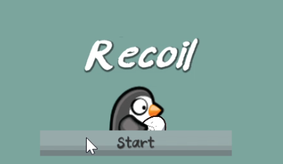
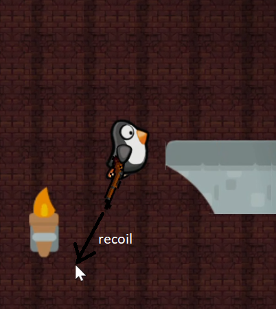
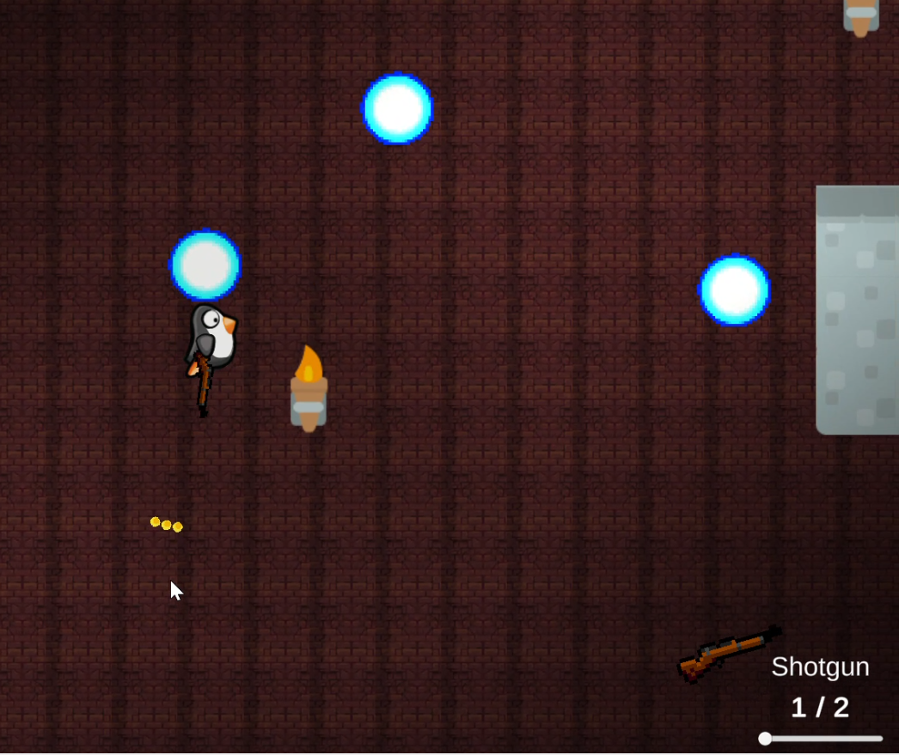
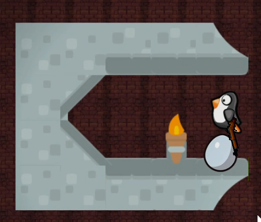
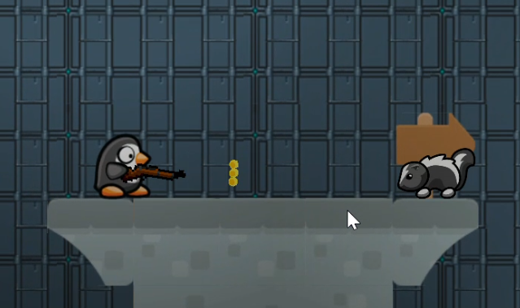
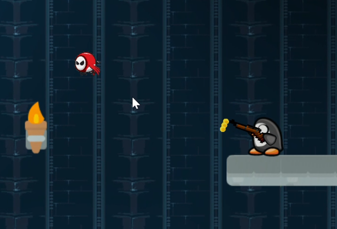

    

# Introduction to the Game

Recoil is an action-platformer game where you assume the role of Pingu the Penguin, on a journey to rescue **Benedict the Egg**, who has been kidnapped by the **Navy Seal**.

&nbsp;

Pingu cannot innately jump, and can move only left and right.
But armed with **_guns_**, Pingu can traverse great heights and distances using the recoil mechanic. Player have to master this mechanic in order to pass stages and reach the Navy Seal.

# Features

- **22 different stages** that test your recoil mechanic mastery
- **3 unique weapons**, each with a different recoil mechanic
- **Easter egg collectibles** throughout the labyrith
- **30 mins++** worth of fun!

> P.S. If you're interested in the details of our game design, visit the [report](REPORT.docx) and [final checkpoint slides](https://docs.google.com/presentation/d/e/2PACX-1vQFQ5V24Kf21UT13KwYKII_u5fMjBHDwYlm7RuOL2R71W9lvnPlBW68L_oItyH55JE4pRXMBPcGga8a/pub?start=false&loop=false&delayms=3000).

# Screenshots

# Playthrough Videos

- Speedrun with timestamps for relevant features [here](https://www.youtube.com/watch?v=2_mM3nSqtXs)
